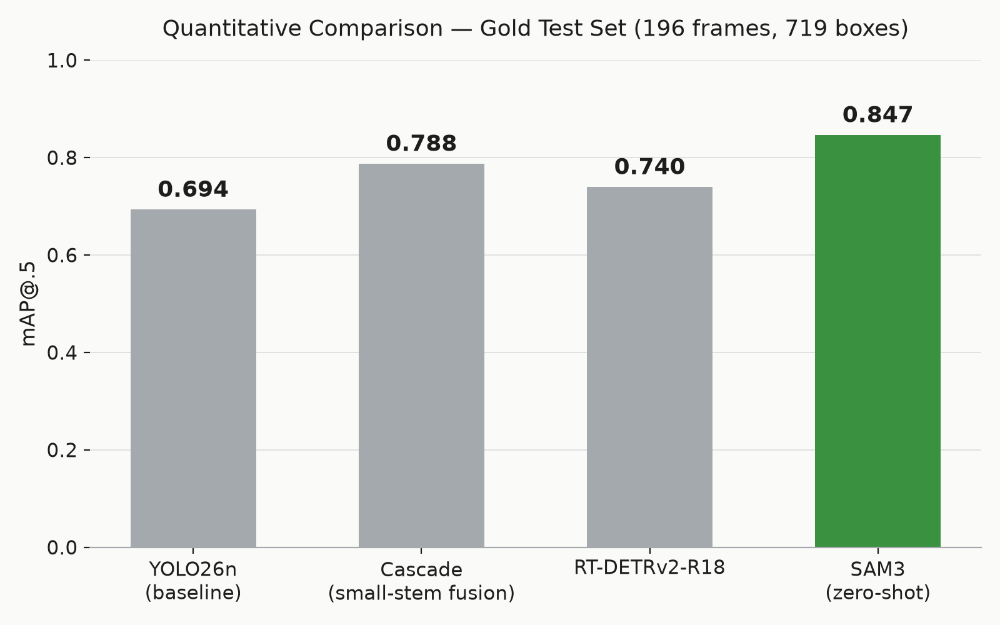
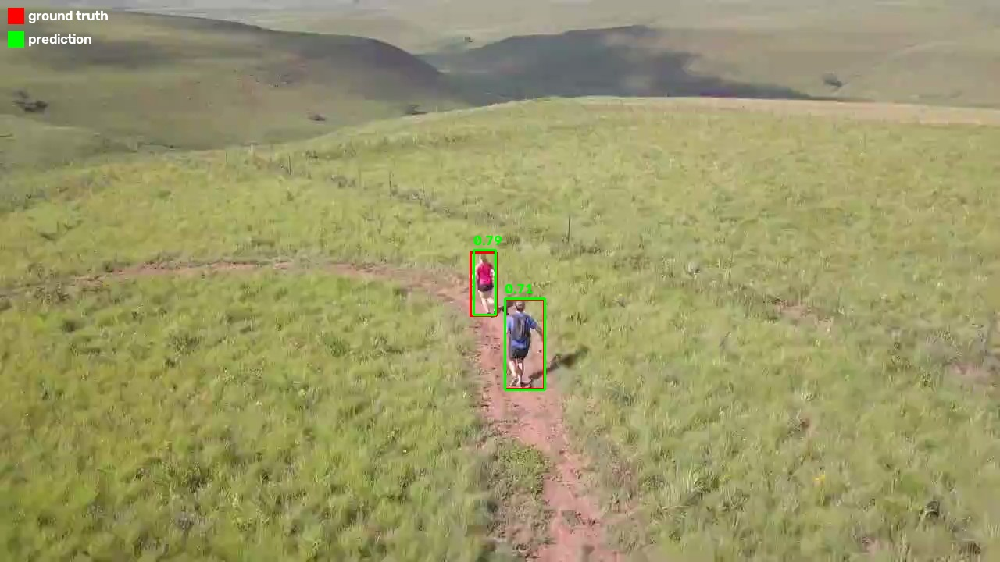
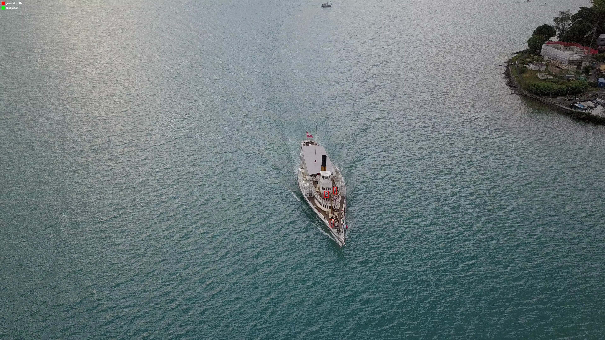
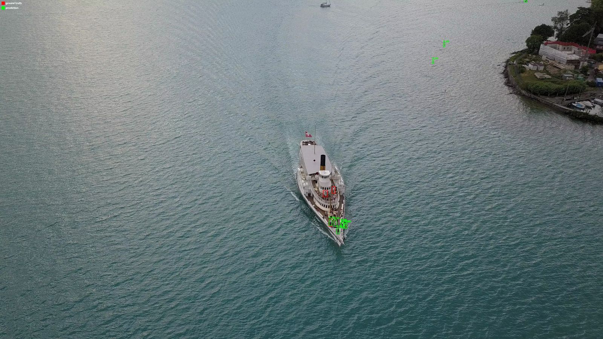
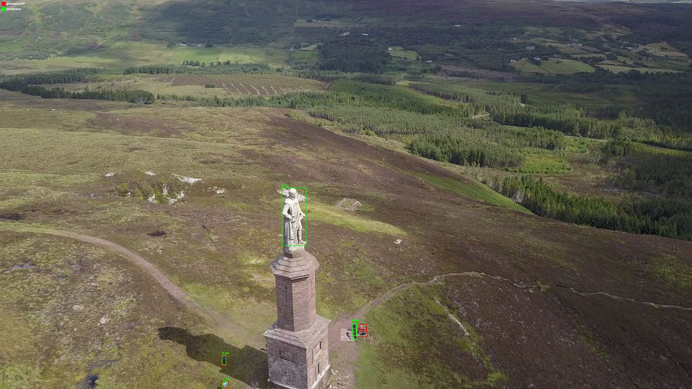
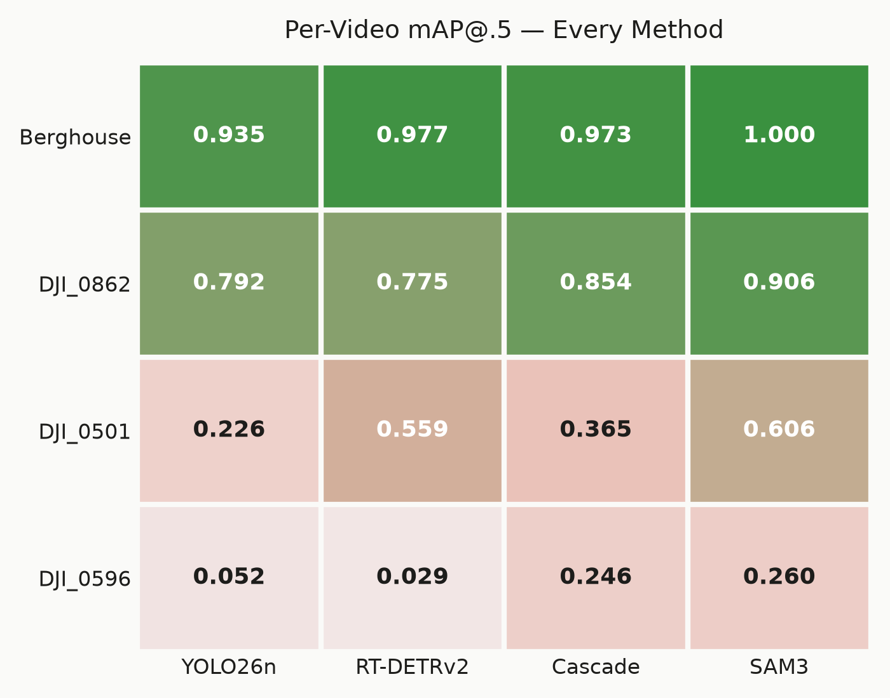
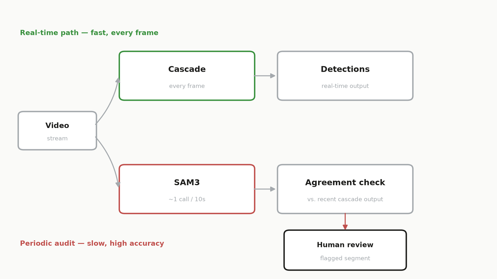

# Object Detection Under Label Scarcity

**Detecting and localizing `person` in aerial drone footage, with almost no
ground truth to start from.**

This repository is the deliverable for a computer-vision take-home
assignment (`../bilgisayarli_goru_mulakat_gorevi.pdf`, kept outside the repo):
given 13 short, largely unlabeled drone video clips
([Kaggle `kmader/drone-videos`](https://www.kaggle.com/datasets/kmader/drone-videos),
DJI Mavic Pro footage across the Swiss Alps, Scotland, Iceland and more),
choose one object class, build a detector that localizes it, and validate
the result without a labeling budget for the whole dataset.

**What was actually done, in one paragraph:** `person` was chosen as the
target after a systematic inventory of all 13 videos against explicit
selection criteria (`docs/00_target_selection.md`). A small (196-frame)
test set was labeled entirely by hand in CVAT and never touched by any
model output — every number in this README comes from scoring predictions
against that gold set. Training/validation data was instead pseudo-labeled
automatically with SAM 3 (validated against the same gold set before being
trusted), because labeling the full dataset by hand was out of scope. Four
genuinely different detection approaches were then built and benchmarked
on identical, video-level train/val/test splits: a zero-shot YOLO26n
baseline, a two-stage YOLO+ResNet18 "cascade" verifier designed to recover
the baseline's small-object blind spot, a zero-shot RT-DETR transformer
detector, and SAM 3 itself used zero-shot as a foundation-model detector
(the assignment's required "genuinely different alternative approach").

**Headline result:** the untrained YOLO26n baseline scores **mAP@.5
0.693**; the trained cascade reaches **0.786** (the best deployable,
trained method); zero-shot SAM 3 tops the table at **0.846** but runs
~10× slower than any trained detector. No single method wins on every
axis — see [Results](#results) for the full comparison and
[Strengths, Weaknesses & Cost](#strengths-weaknesses--cost) for why.

---

## Table of contents

- [Assignment & problem framing](#assignment--problem-framing)
- [Target selection](#target-selection)
- [Repository layout](#repository-layout)
- [Setup](#setup)
- [Reproducing the results](#reproducing-the-results)
- [Data preparation & labeling strategy](#data-preparation--labeling-strategy)
- [Methods](#methods)
- [Results](#results)
- [Qualitative examples](#qualitative-examples)
- [Error analysis](#error-analysis)
- [Strengths, weaknesses & cost](#strengths-weaknesses--cost)
- [Proposed production system](#proposed-production-system)
- [Honest limitations & future work](#honest-limitations--future-work)
- [Reproducibility](#reproducibility)
- [Presentation](#presentation)
- [References](#references)

---

## Assignment & problem framing

The assignment ("Drone Videolarında Nesne Tespiti") asks for a prototype
that detects and localizes one chosen object class in drone video, under
these constraints: the dataset has no ground truth at all, labeling all of
it by hand is explicitly out of scope, and the reasoning behind every
choice — problem framing, data strategy, alternative approaches, and error
analysis — is graded as heavily as the final numbers.

Framed that way, this is not really an object-detection problem — it's
object detection **under label scarcity**, which is also the realistic
situation in most applied computer-vision work: a new class or a new
camera network almost never arrives with labels attached.

## Target selection

`person` was selected after inventorying all 13 videos
(`results/inventory/video_inventory.csv`, `results/dataset_overview/table.csv`)
and scoring every candidate class against four explicit criteria: presence
in several videos, real scale variation, a large enough instance count, and
genuine occlusion/hard-negative material. `person` appears in **11 of 13**
videos, has strong altitude-driven scale variation, easily 500+ instances,
and rich occlusion (vegetation, footbridges, shadow blending into rock,
small figures next to sled dogs in snow). It is also already a COCO class,
which keeps the zero-shot baseline's domain-gap measurement meaningful —
the model already knows "person," so failures measure viewpoint/scale/
resolution gap, not an unfamiliar concept. Rejected candidates (boat,
vehicle, sled dog, statue/lagoon) each failed at least one criterion; full
table in `docs/00_target_selection.md`.

## Repository layout

```
configs/        one YAML per experiment/script run — no hardcoded hyperparameters
data/           gitignored; see "Setup" below for how to reconstruct it
                (exceptions kept in git: data/splits/*.txt, data/gold_test/annotations.json)
docs/
  decision_log.md               every non-obvious technical decision, dated, with rationale
  00_target_selection.md        full target-class candidate table
  01_cascade_journey_summary.md  the cascade's 8-step iteration history
  02_rtdetr_journey_summary.md   RT-DETR zero-shot findings
  03_sam3_journey_summary.md     SAM3 labeling + zero-shot findings
  sunum_icerik.md                presentation content (source of truth for slide text)
  presentation/                  docs/presentation/deck.html — the interactive slide deck
  reference/                     literature review notes
notebooks/      the 4 Colab notebooks that run every GPU step (see below)
scripts/        numbered CLI entry points, 01 through 35 — one per pipeline step/experiment
src/
  data/         frame sampling
  methods/
    yolo/               baseline model + cascade verifier + hybrid scoring (src/methods/yolo/)
    rtdetr/              RT-DETR (HF + Ultralytics) wrappers
    sam3_zeroshot/        SAM3 pipeline (labeling tool AND zero-shot detector)
    convnext_centernet/   Tier-2 stretch goal — not implemented this cycle (empty module)
    keypoint_tracking/    Tier-3 stretch goal — not implemented this cycle (empty module)
  eval/         COCO-style metrics, precision/recall/F1, comparison plots
results/        generated tables/figures/logs/predictions — never edited by hand;
                results/eval/comparison.csv is the single source for every number in this README
```

## Setup

### 1. Local (CPU-only steps: data prep, evaluation, plotting)

```bash
git clone https://github.com/Kametor/object-detection-drone.git
cd object-detection-drone
python3 -m venv .venv
.venv/bin/pip install -r requirements.txt
```

### 2. Get the raw videos

Download the [Kaggle `kmader/drone-videos`](https://www.kaggle.com/datasets/kmader/drone-videos)
dataset and place the clips under `data/raw/drone_videos/`, keeping their
original filenames — the split files in `data/splits/*.txt` reference
videos by exact filename (e.g. `DJI_0596.MP4`, `Berghouse Leopard Jog.mp4`).
Only 13 of the dataset's clips are used; which ones and why is in
`docs/00_target_selection.md`.

```bash
kaggle datasets download -d kmader/drone-videos -p data/raw/ --unzip
```

### 3. GPU steps (Colab, free T4 tier)

Everything that needs a GPU — SAM3 auto-labeling, verifier training, the
GPU method comparison, and the SAM3 zero-shot benchmark — runs from the
notebooks in `notebooks/`, each of which clones this repo fresh, mounts
Google Drive for the video/checkpoint data, and installs
`requirements.txt`. Open any of them directly in Colab:

| Notebook | Purpose |
|---|---|
| [`01_sam3_autolabel.ipynb`](notebooks/01_sam3_autolabel.ipynb) | SAM3 pseudo-labeling of train/val videos + validation against the gold test set |
| [`02_train_verifier.ipynb`](notebooks/02_train_verifier.ipynb) | Trains the cascade's ResNet18 crop-verifier (item 1b) |
| [`03_gpu_method_comparison.ipynb`](notebooks/03_gpu_method_comparison.ipynb) | Re-runs Method 1 / cascade on a T4 for hardware-consistent numbers |
| [`04_sam3_zeroshot_eval.ipynb`](notebooks/04_sam3_zeroshot_eval.ipynb) | Benchmarks SAM3 zero-shot as a detector on the gold test set |
| [`05_rtdetr_zeroshot_T4_eval.ipynb`](notebooks/05_rtdetr_zeroshot_T4_eval.ipynb) | Re-runs both RT-DETR checkpoints on a T4 for hardware-consistent FPS |
| [`06_render_result_video.ipynb`](notebooks/06_render_result_video.ipynb) | Renders the cascade's predictions on the 4 test videos into one annotated demo video |

No standard/Pro Colab tier is used or required — every result in this
README was produced on the free T4 tier, per the assignment's single-GPU
constraint.

## Reproducing the results

Every table in this README is generated from a file under `results/`, via
`src/eval/metrics.py`, never written by hand. The prediction files
(`results/*/predictions.json`) are committed to the repo, so the
evaluation step itself needs no GPU and no re-running of any model:

```bash
.venv/bin/python scripts/06_evaluate.py \
    --predictions results/eval/sam3_zeroshot_T4/predictions.json \
    --method-name sam3_zeroshot_T4 \
    --config configs/06_evaluate.yaml
```

This appends a row to `results/eval/comparison.csv` and writes per-video /
per-size breakdowns to `results/eval/sam3_zeroshot_T4/metrics.json`. The
full pipeline, end to end, is (in order):

1. `01_inventory.py` — per-video inventory (objects, size, occlusion)
2. `02_sample_frames.py` — frame sampling for manual triage/labeling
3. `03_dataset_overview.py` — dataset summary table
4. `04_label_video.py` — SAM3 auto-labeling (train/val); run inside `01_sam3_autolabel.ipynb` on Colab
5. `05_yolo_zeroshot_eval.py` — YOLO26n zero-shot baseline
6. `06_evaluate.py` — score any method's predictions against the gold test set (reused by every method)
7. `08_threshold_sweep.py` — confidence-floor sweep behind the cascade's Stage-1 choice
8. `09_build_crop_dataset.py` / `10_train_verifier.py` — build the verifier's crop dataset and train it (Colab, `02_train_verifier.ipynb`)
9. `14`/`16`/`22`/`25_cascade_*_eval.py` — the cascade's iteration steps (naive → band-gated → size-gated → score-fusion)
10. `28`/`30_rtdetr_*_eval.py` — RT-DETR zero-shot (HF-R18 and Ultralytics-l checkpoints)
11. `34_sam3_zeroshot_eval.py` — SAM3 as a zero-shot detector (Colab, `04_sam3_zeroshot_eval.ipynb`)
12. `07_visualize_eval.py` — success/failure comparison images used throughout this README and the presentation
13. `36_render_result_video.py` — renders the cascade's predictions on full test videos into one combined demo video (Colab, `06_render_result_video.ipynb`)

Every script takes `--config path/to.yaml` (no magic constants) and writes
a run manifest (config hash, git SHA, seed, timestamp) into `results/`
alongside its output, per the reproducibility rule in `docs/decision_log.md`.

## Data preparation & labeling strategy

- **Splits are made at the video level, never the frame level.** Frames
  within one video are near-duplicates of a single domain; a frame-level
  split would leak the test domain into training and inflate every metric.
  Of the 11 person-containing videos: **6 train / 1 val / 4 test**, plus
  **2** person-free videos held out separately as hard-negative background
  sources. Every split deliberately spans different terrain/lighting
  conditions — see `docs/decision_log.md` and `data/splits/*.txt`.
- **The test set (196 frames, 719 boxes) is 100% hand-labeled in CVAT.** No
  model output ever enters `data/gold_test/annotations.json` — the human
  labeling budget was spent on trustworthy measurement, not on training
  volume.
- **Training/validation labels are pseudo-labels from SAM3**, prompted with
  the word "person," converted from masks to boxes. Before being trusted,
  SAM3 was run on the manually labeled test videos too and scored against
  the same gold annotations (**mAP@.5 = 0.846** — see [Results](#results));
  only then was it used to label the actual training data.
- **Quality pipeline before labels were used for training:** a raised
  confidence threshold (0.3→0.5, after a smoke test showed a runner's
  shadow being boxed as a person at 0.47), NMS/minimum-box-area/
  border-clipping filters, and a full manual audit of the output — which
  caught SAM3 boxing sled dogs as "person" on one video (271 boxes
  corrected by hand and fed back to the verifier as explicit negatives —
  see `docs/decision_log.md`). Final yield: **471 frames, 1,411 boxes**
  across train+val.

## Methods

**1 — Baseline: YOLO26n, zero fine-tuning.** COCO-pretrained, `imgsz=1920`
(aerial people are tiny; the 640 default would erase them), confidence
threshold left at Ultralytics' own default (0.25) to measure the
out-of-the-box domain gap honestly. Result: mAP@.5 0.693 overall, but
**mAP on small objects is 0.018** — on the two hardest test videos it
catches 0 of 44 small/distant people at this threshold (26 of 44 do get a
real, low-confidence candidate box below 0.25 — see `docs/decision_log.md`,
"Correction 2026-09-16"). This one number motivates every method after it.

**2 — Cascade verifier (the primary alternative approach).** A two-stage
system: Stage 1 is the same YOLO26n with its confidence floor dropped to
0.01 (recall triples, at the cost of a 10× flood of false candidates);
Stage 2 is a ResNet18 binary classifier (`src/methods/yolo/verifier.py`)
trained on 64×64 crops to separate real detections from that flood. Built
through eight measured iterations (`docs/01_cascade_journey_summary.md`) —
verifying every box first made results *worse* (F1 0.786→0.514) before
band-gating, video-balanced sampling, score fusion
(`sqrt(yolo_conf × verifier_prob)`), and a small-input ResNet stem (the
original ResNet paper's own design for small inputs, He et al. 2016 §4.2)
got it past the baseline. Result: **mAP@.5 0.786**, the best trained,
deployable method, and the only one that recovers any small-object recall
on the hardest videos (0.000 → 0.081/0.070 mAP_small).

**3 — RT-DETR (a different architecture family).** RT-DETRv2-R18 (Hugging
Face) and RT-DETR-l (Ultralytics), both zero-shot. Higher mAP and recall
than the YOLO baseline, but 2-4× more false positives, and a real,
architecture-specific fragility: forced to YOLO's input resolution,
RT-DETRv2-R18's mAP collapses 0.740→0.253 because it has no NMS at
inference — its one-query-per-object behavior is learned for one specific
resolution. It is also measurably more resistant to a false-positive trap
(a human statue) that fools both YOLO and SAM3 — see
[Error analysis](#error-analysis).

**4 — SAM3, zero-shot foundation-model detector (the assignment's required
genuinely-different alternative).** The same SAM3 model used as the
labeling tool, here prompted with "person" and benchmarked on the gold
test set under the identical protocol as every other method — zero
training, zero fine-tuning. Best mAP and recall of any method (0.846 /
0.872), at the cost of the worst precision and **~10× the latency** of any
trained detector (0.37 FPS on a T4).

Two further architectures (ConvNeXt+CenterNet+FPN, and a LoFTR-based
keypoint-tracking alternative) were planned as lower-priority stretch
goals and were **not implemented this cycle** — see
[Honest limitations & future work](#honest-limitations--future-work).

## Results

All numbers below are read directly from `results/eval/comparison.csv` and
each method's `metrics.json`; none are hand-typed. Methods are ranked by
**mAP@.5** rather than compared at one shared confidence threshold,
because their confidence scores are not on the same scale (a CNN's raw
objectness score, a fused two-model score, and a foundation model's
prompt-similarity score do not mean the same thing at "0.25") — mAP sweeps
every method's own threshold internally, making it the one genuinely
apples-to-apples number here. Precision/recall/F1 are still reported, each
at that method's own as-designed operating point (stated in the `conf`
column), for a complementary single-point view.

**Gold test set: 196 frames, 719 boxes, 4 held-out videos.**

| Method | Hardware | conf | mAP@.5 | mAP@[.5:.95] | Precision | Recall | F1 | FP | FPS |
|---|---|---|---|---|---|---|---|---|---|
| YOLO26n (baseline, zero-shot) | T4 | 0.25 | 0.693 | 0.479 | 0.853 | **0.726** | 0.784 | 90 | 7.3 |
| **Cascade — small-stem ResNet18 + score fusion** | T4 | 0.38 | **0.786** | **0.526** | **0.890** | 0.708 | **0.789** | **63** | not yet benchmarked |
| Cascade — EfficientNet-B0 verifier (tried, not adopted) | T4 | 0.38 | 0.777 | 0.521 | 0.879 | 0.705 | 0.782 | 70 | not yet benchmarked |
| RT-DETRv2-R18 | CPU¹ | 0.25 | 0.740 | 0.468 | 0.609 | 0.761 | 0.677 | 351 | not yet benchmarked |
| RT-DETR-l (Ultralytics) | CPU¹ | 0.25 | 0.731 | 0.460 | 0.762 | 0.748 | 0.755 | 168 | not yet benchmarked |
| SAM3 (zero-shot foundation model) | T4 | 0.25 | **0.846** | **0.626** | 0.485 | **0.872** | 0.624 | 665 | **0.37** |

¹ RT-DETR's own inference script uses GPU automatically when available;
these two runs have not yet been re-executed on a T4 in this cycle, so
their FPS is not comparable to the other rows and is intentionally left
out rather than reported misleadingly. See
[Honest limitations](#honest-limitations--future-work).

**Breakdown by object size (mAP@.5, whole test set)** — small objects are
the dominant failure mode for every method, without exception:

| | Small (<32px) | Medium | Large (>96px) |
|---|---|---|---|
| YOLO26n | 0.018 | 0.472 | 0.676 |
| Cascade | 0.073 | 0.523 | 0.689 |
| RT-DETRv2-R18 | 0.000 | 0.418 | 0.743 |
| SAM3 | 0.070 | 0.669 | 0.773 |

**Breakdown by video (mAP@.5)** — difficulty tracks the footage, not the
detector: every method's own easiest-to-hardest video ranking is nearly
identical.

| Video | YOLO26n | Cascade | RT-DETRv2 | SAM3 |
|---|---|---|---|---|
| Berghouse (grass trail, 2 runners) | 0.935 | 0.973 | 0.977 | 1.000 |
| DJI_0862 (volcanic terrain) | 0.792 | 0.854 | 0.775 | 0.906 |
| DJI_0501 (hilltop monument) | 0.226 | 0.365 | 0.559 | 0.606 |
| DJI_0596 (ship deck, tiny distant figures) | 0.052 | 0.246 | 0.029 | 0.260 |



## Qualitative examples

**Success.** YOLO26n boxes two runners tightly at high confidence (0.78,
0.74) — the easy end of this dataset.



**Failure.** The same model, on the ship-deck video: ground-truth boxes on
tiny, distant people — zero predictions anywhere in the frame at the
default 0.25 threshold.



**All three outcomes in one frame.** SAM3 on DJI_0596: a correctly boxed
cluster on the rear deck, a missed pair near the wheelhouse, and 2-3 false
positives over open water (plausibly wave glare read as a distant person).



**Ambiguous — is it even a person?** A stone monument on a Scottish
hilltop, human-shaped and human-posed but not alive. Ground truth
correctly excludes it, but YOLO26n boxes it as `person` in 8 of 10 sampled
frames (conf 0.81-0.89) and SAM3 in 7 of 10 (conf 0.58-0.71). Both RT-DETR
checkpoints resist this specific trap (1-2 of 10 frames) — a real,
measured architectural difference (`results/*/predictions.json`), not an
eyeballed one. See [Methods](#methods) for why this may relate to
attention-based global context vs. local convolutional shape-matching.



## Error analysis

The per-size and per-video tables in [Results](#results) already carry the
main finding: **small, distant subjects are the dominant failure mode for
every method tried**, not a weakness of any one architecture. The
heat-grid below makes the same point visually — one column (DJI_0596) is
dark for every method, one row (SAM3) is lighter than the rest, but the
overall pattern — easy videos stay easy, hard videos stay hard — repeats
across all four.



The statue case above (DJI_0501) is a different kind of error entirely: not
a detector mistake, but a genuine "is this the target class at all"
ambiguity that different architectures resolve differently — worth
flagging on its own rather than folding into an aggregate false-positive
count.

## Strengths, weaknesses & cost

| Method | Strengths | Weaknesses |
|---|---|---|
| **YOLO26n** | Fastest, simplest, zero training cost, best precision of any method tried | Structurally blind to small/distant people |
| **Cascade** | Only method that recovers small-object recall from zero; best mAP among trained, deployable methods | Two-stage inference cost; verifier is data-hungry |
| **RT-DETR** | Genuinely different architecture; competitive ranking quality; measurably more resistant to the statue false-positive | More false positives; resolution-fragile (no NMS); fine-tuning not attempted this cycle |
| **SAM3** | Best accuracy and recall of any method, zero training | ~10× slower than any trained detector; not deployable as-is; used here as labeling teacher and periodic auditor |

**Cost, reported honestly:**
- Verifier backbone: ResNet18 11.2M params vs. EfficientNet-B0 4.0M params
  — fewer parameters is not faster on CPU here: EfficientNet ran **~5×
  slower** per crop (depthwise-separable convolutions vectorize poorly on
  general CPU kernels; the efficiency gain is real, but GPU-side).
- RT-DETRv2-R18: 20.2M params · RT-DETR-l: 33.0M params.
- SAM3: **0.37 FPS on T4** (2.72s/frame mean) — the only method with a
  committed, reproducible speed number so far.
- YOLO26n baseline: **7.3 FPS on T4**, 3.2 FPS on an M1 CPU (measured
  end-to-end pipeline throughput — frame read + inference + drawing the
  review image — not isolated model-only inference).
- Cascade and RT-DETR end-to-end FPS on T4: **not yet benchmarked** with a
  dedicated script — an open item, tracked in
  [Honest limitations](#honest-limitations--future-work), not a hidden gap.
- Human labeling cost: the 196-frame gold test set was fully hand-labeled
  in CVAT; the 471-frame train/val set was pseudo-labeled automatically
  and spot-checked (271 SAM3 boxes manually corrected during the
  dog-vs-person audit — see [Data preparation](#data-preparation--labeling-strategy)).

## Proposed production system

Not one model — a combination, each doing the job it's actually good at:
the **cascade runs on every frame** (fast, the best mAP of any trained
method here), and **SAM3 runs periodically** (roughly once every 10
seconds) as a drift/anomaly auditor — far too slow for real-time, but the
highest-accuracy detector available. If SAM3's periodic reading disagrees
sharply with what the cascade has been reporting on the same scene, the
segment is flagged for human review. This mirrors exactly how the two
models are already used earlier in this project: SAM3 as the
pseudo-labeling teacher, the cascade as the deployable student — extended
here into an ongoing role instead of a one-time labeling pass.



## Honest limitations & future work

**Not yet done, and why (time-boxed, not forgotten):**
- **Fine-tuning YOLO26n on our own pseudo-labels** — every YOLO result in
  this README uses the *zero-shot* checkpoint as the detection backbone;
  this is the single highest-priority item still open.
- **RT-DETR fine-tuning** — transformer detectors are more data-hungry;
  judged too risky to attempt on this project's modest pseudo-label set
  in the remaining time. A deliberate cut, not an oversight.
- **ConvNeXt+CenterNet+FPN** and a **LoFTR-based keypoint-tracking**
  alternative — both planned as lower-priority stretch goals
  (`src/methods/convnext_centernet/`, `src/methods/keypoint_tracking/`
  exist as empty placeholders); not implemented this cycle.
- **End-to-end FPS for the cascade and RT-DETR on T4** — only SAM3 and the
  YOLO26n baseline have a measured, reproducible speed number so far.
- **TensorRT export + FP16** — expected to move the trained detectors'
  FPS numbers considerably; not attempted.
- **YOLO P2 detection head + SAHI tiling** — both target the small-object
  failure directly inside the detector, as an alternative to the
  second-stage verifier approach actually built.
- **A combined result video** running the cascade across the test
  videos — the notebook (`notebooks/06_render_result_video.ipynb`) and
  script (`scripts/36_render_result_video.py`) are written and pushed;
  the actual video hasn't been rendered yet (needs a live Colab session).

**Structural limitations, not a to-do list:**
- Small-object detection remains the dominant failure mode for every
  method tried; the cascade only partially recovers it.
- The gold test set has only 4 videos — enough for a genuine per-condition
  breakdown, but a small statistical sample. Generalization claims are
  bounded accordingly.

**Explicitly out of scope / future work, not this cycle:** synthetic data
augmentation via Blender domain randomization (optionally with Gaussian
splatting for view synthesis) to scale labeling further, and INT8
quantization for edge deployment.

## Reproducibility

- Every script takes `--config path/to.yaml` — no hardcoded hyperparameters.
- Every run writes a manifest (config hash, git SHA, seed, timestamp) into
  `results/manifests/`.
- The gold test set (`data/gold_test/annotations.json`) is never touched
  by any pseudo-labeling or training step.
- Every table in this README is generated from a file under `results/`
  (primarily `results/eval/comparison.csv`) — never written by hand. If a
  number is marked "not yet benchmarked" above, that run genuinely has not
  happened yet.
- The full, dated rationale behind every non-obvious decision — including
  the ones that didn't work — is in `docs/decision_log.md` and the
  per-method journey summaries (`docs/01_cascade_journey_summary.md`,
  `docs/02_rtdetr_journey_summary.md`, `docs/03_sam3_journey_summary.md`).

## Presentation

An interactive HTML slide deck covering this entire project (problem
framing → data strategy → all four methods → results → error analysis →
production proposal) is at
[`docs/presentation/deck.html`](docs/presentation/deck.html) — open it
directly in a browser. Its content source is
[`docs/sunum_icerik.md`](docs/sunum_icerik.md).

## References

**Models**
- Ren, S. et al. *RT-DETR: DETRs Beat YOLOs on Real-Time Object Detection.* CVPR 2024.
- Lv, W. et al. *RT-DETRv2: Improved Baseline with Bag-of-Freebies.* 2024.
- Meta AI. *SAM 3: Segment Anything with Concepts.* 2025.
- Redmon, J. et al. *You Only Look Once: Unified, Real-Time Object Detection (YOLO).* CVPR 2016.
- Jocher, G. et al. *Ultralytics YOLO (YOLO26).* Ultralytics, 2024-2025.
- He, K. et al. *Deep Residual Learning for Image Recognition (ResNet).* CVPR 2016.
- Tan, M. & Le, Q. *EfficientNet: Rethinking Model Scaling for Convolutional Neural Networks.* ICML 2019.

**Datasets**
- Kaggle `kmader/drone-videos` — DJI Mavic Pro drone footage (source dataset for this project).

**Evaluation**
- Lin, T.-Y. et al. *Microsoft COCO: Common Objects in Context* (evaluation protocol — mAP@.5, mAP@[.5:.95], size-based breakdown). ECCV 2014.

**Tools / Libraries**
- `ultralytics`, `transformers` (Hugging Face), `pycocotools`, `torch` / `torchvision`, CVAT (manual annotation).

---

**Author:** Mehmet Recep Aşkar — Computer Vision Engineer
